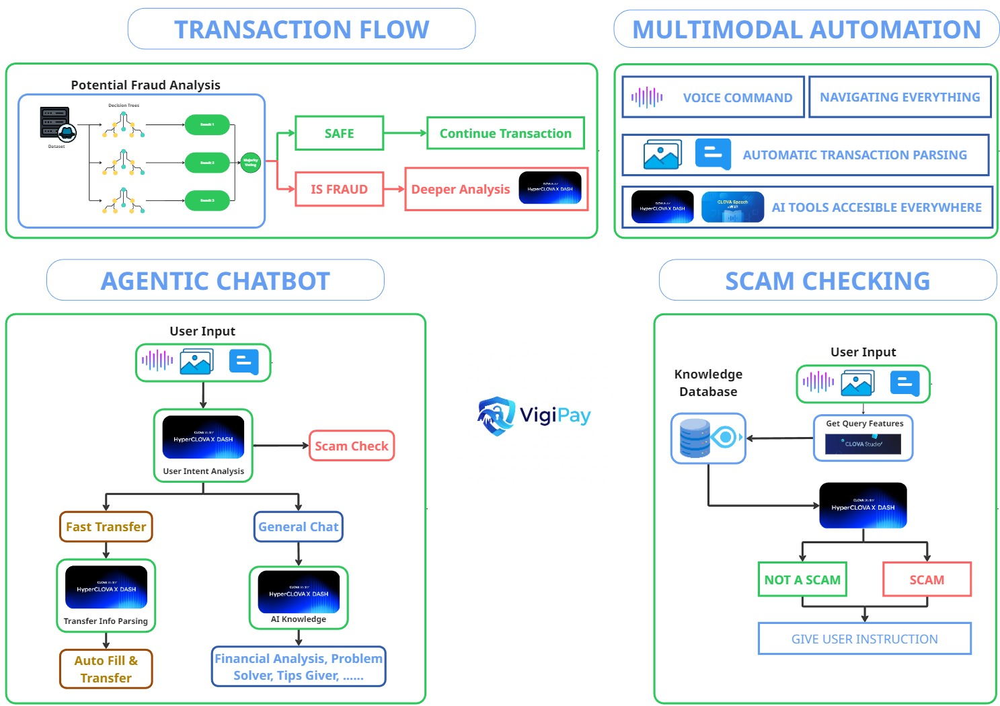

#  VigiPay
### **AI-Powered Multimodal Banking Assistant with Real-Time Scam Detection**


[](https://github.com/)
[](https://www.python.org/downloads/)
[](https://reactjs.org/)

VigiPay is an intelligent banking platform that integrates **Scam Checking**, **AI Automation**, and **Multimodal Interaction** (text, voice, image) to deliver a safer and smarter online banking experience.  
It combines **fraud detection models**, **agentic chatbot workflows**, and **multimodal analysis** to help users verify transactions, detect scam messages, and automate financial tasks.

## App URL

**Live Application:** **[https://vigipay.duckdns.org](https://vigipay.duckdns.org)**
---

## 🚀 Key Features

### 💸 Real-Time Transaction Flow Safety
- Fraud analysis pipeline detects suspicious transaction patterns.
- Safe → Continue  
- Potential Fraud → AI-driven deeper inspection.
### 🔍 Scam Checking Module
- Detects scam messages using multimodal AI (text + voice + image).
- Combines knowledge database with LLM-based reasoning.
- Clear outputs: **SCAM** or **NOT A SCAM**, with safety instruction.

### 🤖 Multimodal Automation
- Supports **voice commands**, **image understanding**, and **text input**.
- Automatically extracts transaction info from screenshots or messages.
- AI tools accessible across the full banking interface.

### 💬 Agentic Chatbot
- Understands user intent from multimodal inputs.
- Routes to:
  - **Fast Transfer** — Auto-fill + auto-transfer.
  - **General Chat** — Financial tips, problem solving, advice.
  - **Scam Check** — Pre-transfer safety filter.

---

## 🏗️ System Architecture

The system is composed of four connected modules that work together to provide a seamless and secure user experience. The diagram below illustrates the flow of data and interaction between these components.



---

## 📁 Project Structure

VigiPay/  
├── backend/  
│ └── prompts  
│ ├── rag_database  
│ ├── src  
├── frontend/  
│ ├── public/  
│ ├── src/  
│ | ├── apis  
│ | ├── components  
│ | ├── contexts  
│ | ├── hooks  
│ | ├── i18n  
│ | ├── lib  
│ | ├── pages  
├── docs/  
│ └── system_architecture.png  
└── README.md

---

## 🛠️ Tech Stack

| Area      | Technology                                                                                                  |
| :-------- | :---------------------------------------------------------------------------------------------------------- |
| **Frontend** | React, TypeScript, Vite, Tailwind CSS, shadcn/ui, Lucide React, React Router                               |
| **Backend**  | Python 3.9+, FastAPI, SQLAlchemy, Uvicorn, Pydantic, python-jose (JWT)                                      |
| **AI / ML**  | Naver Cloud Platform (HyperCLOVA X, OCR, ASR), Scikit-learn, Pandas, Milvus                                 |
| **Database** | **Vector DB:** Milvus <br/> **Relational DB:** SQLite (Dev), PostgreSQL (Production)                         |
| **Infra**    | Docker & Docker Compose (for running Milvus)                                                                |


---

## 🔧 Installation & Setup

### 1. Clone the Repository
```bash
git clone https://github.com/your-username/VigiPay.git
cd VigiPay
```

### 2. Setup Milvus Vector Database
Ensure you have Docker and Docker Compose installed.

```bash
cd docker
docker-compose up -d
```
This command starts the Milvus database required for the RAG system.

### 3. Setup Backend
```bash
cd backend

# Create and activate a Python virtual environment
python3 -m venv venv
source venv/bin/activate  # On Windows: venv\Scripts\activate

# Install dependencies
pip install -r src/requirements.txt

# Create your .env file
cp .env.example .env
```
**Important:** Open the newly created `backend/.env` file and add your API keys for Naver Cloud and a `SECRET_KEY` for JWT.

Now, run the backend server from the `src` directory:
```bash
cd src
uvicorn hypercolvax:app --host 0.0.0.0 --port 8000 --reload
```
The API documentation will be available at `http://localhost:8000/docs`.

### 4. Setup Frontend
```bash
cd frontend

# Install dependencies
npm install

# Create your local environment file
cp .env.example .env.local
```
Ensure the `VITE_API_BASE_URL` in `frontend/.env.local` is set to `http://localhost:8000`.

Finally, start the frontend development server:
```bash
npm run dev
```
The application will be accessible at `http://localhost:5173`.

---


