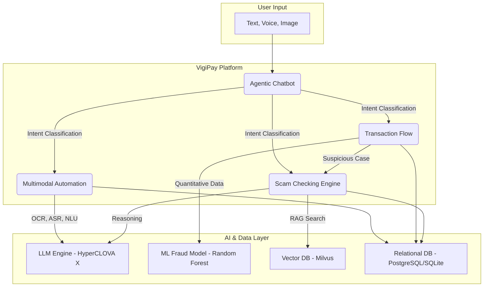

# 🌐 VigiPay
### **AI-Powered Multimodal Banking Assistant with Real-Time Scam Detection**

VigiPay is an intelligent banking platform that integrates **Scam Checking**, **AI Automation**, and **Multimodal Interaction** (text, voice, image) to deliver a safer and smarter online banking experience.  
It combines **fraud detection models**, **agentic chatbot workflows**, and **multimodal analysis** to help users verify transactions, detect scam messages, and automate financial tasks.

## App URL

**Live Application:** **[https://vigipay.duckdns.org](https://vigipay.duckdns.org)**
---

## 🚀 Key Features

### 💸 Real-Time Transaction Flow Safety
- Fraud analysis pipeline detects suspicious transaction patterns.
- Safe → Continue  
- Potential Fraud → AI-driven deeper inspection.
### 🔍 Scam Checking Module
- Detects scam messages using multimodal AI (text + voice + image).
- Combines knowledge database with LLM-based reasoning.
- Clear outputs: **SCAM** or **NOT A SCAM**, with safety instruction.

### 🤖 Multimodal Automation
- Supports **voice commands**, **image understanding**, and **text input**.
- Automatically extracts transaction info from screenshots or messages.
- AI tools accessible across the full banking interface.

### 💬 Agentic Chatbot
- Understands user intent from multimodal inputs.
- Routes to:
  - **Fast Transfer** — Auto-fill + auto-transfer.
  - **General Chat** — Financial tips, problem solving, advice.
  - **Scam Check** — Pre-transfer safety filter.

---

## 🏗️ System Architecture

The system is composed of four connected modules that work together to provide a seamless and secure user experience. A full architecture diagram is available in `/docs/system_architecture.png`.


---

## 📁 Project Structure

VigiPay/  
├── backend/  
│ └── prompts  
│ ├── rag_database  
│ ├── src  
├── frontend/  
│ ├── public/  
│ ├── src/  
│ | ├── apis  
│ | ├── components  
│ | ├── contexts  
│ | ├── hooks  
│ | ├── i18n  
│ | ├── lib  
│ | ├── pages  
├── docs/  
│ └── system_architecture.png  
└── README.md

---

## 🛠️ Tech Stack

- **Backend:** Python  
- **LLM:** HyperCLOVA X Dash (or custom model)  
- **Frontend:** React / Next.js  
- **Database:** PostgreSQL / MongoDB  
- **AI Modules:** OCR, ASR, multimodal embeddings from Clova Studio 

---

## 🔧 Installation

### 1. Clone the repository
```bash
git clone https://github.com/yourname/VigiPay-LunchCubee.git
```
cd VigiPay-LunchCubee
### 2. Setup backend
```
cd backend
cd src
python -m venv chatbotvenv
. chatbotvenv/bin/activate
pip install -r requirements.txt
uvicorn hyperclovax:app --host 0.0.0.0 --port 6011
```
### 3. Setup frontend
```bash
cd frontend
npm install
npm run dev
```


